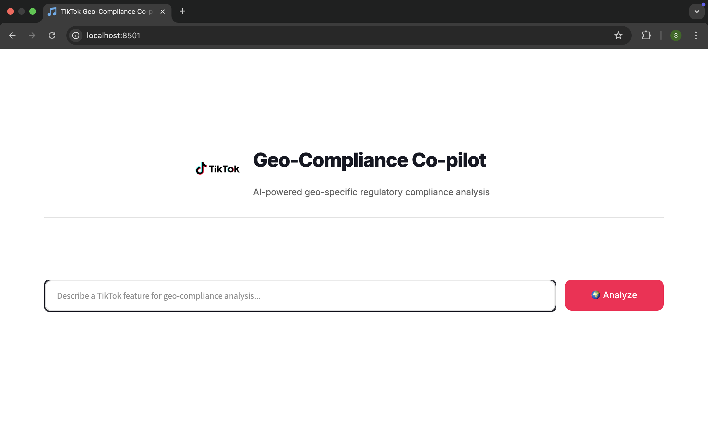
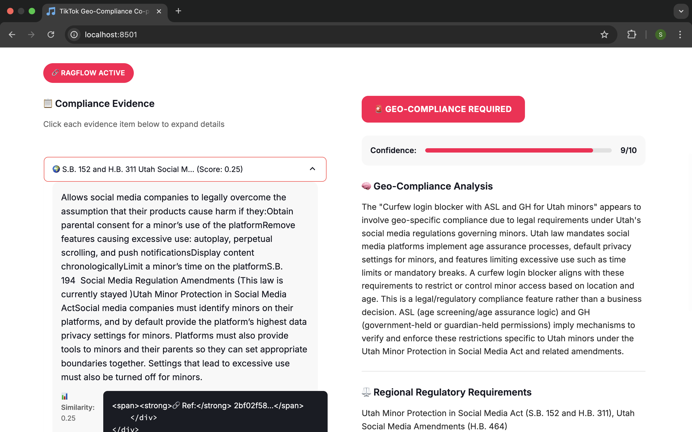
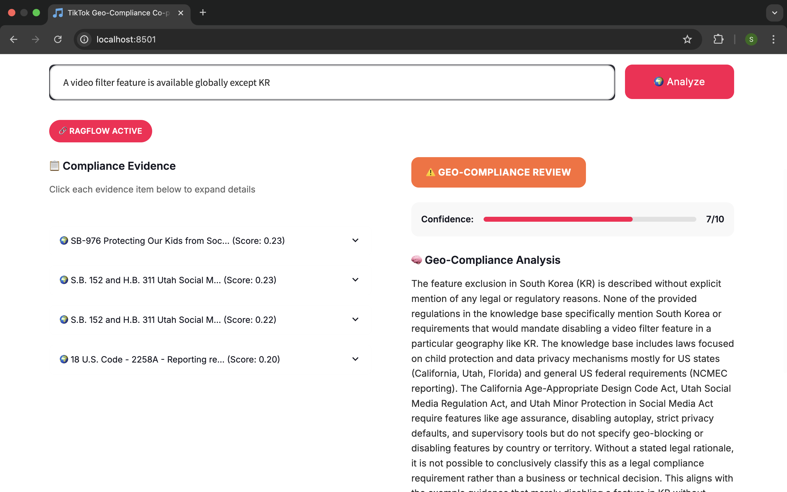
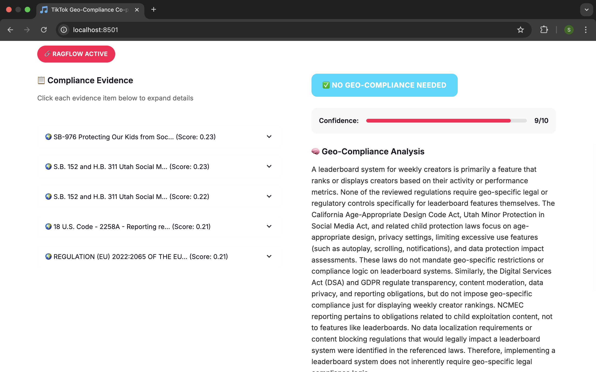

# TikTok Geo-Compliance Co-pilot

AI-powered geo-specific regulatory compliance analysis system that helps TikTok product teams identify features requiring geo-specific compliance logic.

## Problem Statement

As TikTok operates globally, every product feature must dynamically satisfy dozens of geographic regulations – from Brazil's data localization to GDPR. This system addresses the critical challenge of distinguishing between:

- ✅ **Legal compliance requirements** (e.g., age gates for Indonesia Child Protection Law)
- ❌ **Business decisions** (e.g., market testing restrictions)
- ❓ **Unclear cases** requiring human review

**Without automated compliance detection, risks include:**
- ⚖️ Legal exposure from undetected compliance gaps
- 🛑 Reactive firefighting during regulatory inquiries
- 🚧 Manual overhead in scaling global feature rollouts

## Solution

This prototype system utilizes LLM capabilities with RAGFlow integration to:

- **Flag features** that require geo-specific compliance logic
- **Provide evidence-based reasoning** with regulatory document references
- **Generate audit trails** for regulatory transparency
- **Distinguish** between legal requirements vs business decisions

## Quick Start

### Prerequisites

- Python 3.8+
- RAGFlow instance with regulatory documents loaded
- OpenAI API access (optional, for reranking)

### Installation

1. **Clone the repository**
   ```bash
   git clone https://github.com/samuelthen/tiktok-techjam-geocompliance.git
   cd tiktok-techjam-geocompliance
   ```

2. **Install dependencies**
   ```bash
   pip install -r requirements.txt
   ```

3. **Configure environment variables**
   
   Create a `.env` file in the project root:
   ```env
   # RAGFlow Configuration (Required)
   RAGFLOW_API_KEY=your_ragflow_api_key
   RAGFLOW_BASE_URL=http://your-ragflow-instance:9380
   RAGFLOW_ASSISTANT_ID=your_assistant_id
   
   # OpenAI Configuration (Optional - for evidence reranking)
   OPENAI_API_KEY=your_openai_api_key
   ```

4. **Run the application**
   ```bash
   streamlit run fixed_tiktok_app.py
   ```

5. **Access the app**
   
   Open your browser to `http://localhost:8501`

## Configuration Details

### RAGFlow Setup

This system requires a RAGFlow instance with regulatory compliance documents loaded. The knowledge base contains the following 5 documents:

1. **EU Digital Services Act (DSA)** - European content moderation and transparency requirements
2. **California - Protecting Our Kids from Social Media Addiction Act** - State-level social media restrictions for minors
3. **Florida - Online Protections for Minors** - Age verification and content filtering requirements
4. **Utah - Utah Social Media Regulation Act** - Social media platform obligations for minors
5. **US - Reporting requirements for child sexual abuse content to NCMEC** - Federal reporting obligations for platforms

### Environment Variables

| Variable | Description | Required |
|----------|-------------|----------|
| `RAGFLOW_API_KEY` | API key for RAGFlow instance | Yes |
| `RAGFLOW_BASE_URL` | Base URL of your RAGFlow deployment | Yes |
| `RAGFLOW_ASSISTANT_ID` | ID of the compliance-trained assistant | Yes |
| `OPENAI_API_KEY` | OpenAI API key for evidence reranking | No |

## Usage

1. **Enter Feature Description**: Describe a TikTok feature in the text input
2. **Click Analyze**: The system will analyze for geo-compliance requirements
3. **Review Results**: 
   - Classification (YES/NO/UNCERTAIN)
   - Confidence score (1-10)
   - Detailed reasoning
   - Applicable regulations
   - Supporting evidence chunks

### Example Inputs

✅ **Requires Compliance Logic:**
- "Feature reads user location to enforce France's copyright rules (download blocking)"
- "Age gates specific to Indonesia's Child Protection Law"

❌ **Business Decision (No Compliance):**
- "Geofences feature rollout in US for market testing"

❓ **Needs Human Review:**
- "Video filter feature available globally except KR" (no legal reason specified)

## Demo

### Application Interface

#### Landing Page

*Clean, TikTok-themed interface for entering feature descriptions*

#### Compliance Required Analysis

*System identifies features requiring geo-compliance logic with supporting evidence*

#### Compliance Review Needed

*Uncertain cases flagged for human review with detailed reasoning*

#### No Compliance Required

*Business-driven features correctly identified as not requiring compliance logic*

### Sample Analysis Workflow

1. **Input**: "Live streaming with age verification for users under 16 in Indonesia"

2. **System Processing**:
   - Connects to RAGFlow assistant
   - Retrieves relevant regulatory documents
   - Analyzes compliance requirements using LLM

3. **Output**:
   - **Classification**: YES
   - **Confidence**: 9/10
   - **Reasoning**: Feature requires age verification logic specific to Indonesian Child Protection Law compliance
   - **Regulations**: Indonesia Law No. 35/2014 on Child Protection, Digital platform age verification requirements
   - **Evidence**: Retrieved document chunks showing specific age verification requirements for Indonesian minors

4. **Result**: System correctly identifies this as a legal compliance requirement, not a business decision

## System Architecture

```
User Input → Streamlit Frontend → RAGFlow Client → RAGFlow API → LLM Analysis
                    ↓
Evidence Reranker ← RAGFlow Response ← Regulatory Documents
                    ↓
Results Display ← Processed Response ← Confidence Scoring
```

## Files Structure

```
tiktok-techjam-geocompliance/
├── fixed_tiktok_app.py      # Main Streamlit application
├── ragflow_client.py        # RAGFlow integration client
├── reranking_utils.py       # Evidence reranking utilities
├── requirements.txt         # Python dependencies
├── .env                     # Environment configuration
├── TikTok_logo.svg.png     # Application logo
└── README.md               # This file
```

## Development

### Key Components

1. **RAGFlowClient** (`ragflow_client.py`)
   - Manages RAGFlow API connections
   - Handles compliance analysis prompts
   - Processes structured LLM responses

2. **EvidenceReranker** (`reranking_utils.py`)
   - Re-ranks evidence chunks using OpenAI
   - Improves relevance scoring
   - Optional enhancement for better results

3. **Streamlit App** (`fixed_tiktok_app.py`)
   - User interface and experience
   - TikTok-themed styling
   - Real-time analysis display

### Customization

To adapt for different compliance domains:

1. **Update prompts** in `ragflow_client.py` (lines 71-88)
2. **Modify evidence processing** in `process_compliance_response()`
3. **Adjust UI styling** in the Streamlit app CSS section

## Troubleshooting

### Common Issues

**"RAGFlow connection failed"**
- Verify `RAGFLOW_BASE_URL` is accessible
- Check `RAGFLOW_API_KEY` is valid
- Ensure RAGFlow instance is running

**"Assistant not found"**
- Verify `RAGFLOW_ASSISTANT_ID` exists
- Check assistant has regulatory documents loaded
- Confirm API key has access to the assistant

**Empty or poor responses**
- Ensure regulatory documents are properly indexed
- Check assistant training on compliance topics
- Verify prompt formatting in RAGFlow

### Performance Tips

1. **RAGFlow Optimization**
   - Index regulatory documents with proper chunking
   - Use semantic search for better retrieval
   - Configure appropriate similarity thresholds

2. **Evidence Reranking**
   - Enable OpenAI reranking for improved relevance
   - Adjust `max_chunks` parameter for performance
   - Monitor API usage for cost optimization

## Legal & Compliance Notes

⚠️ **Important**: This is a prototype system for demonstration purposes. For production compliance systems:

- Implement proper audit logging
- Add human review workflows for uncertain cases
- Ensure regulatory document sources are authoritative
- Validate all compliance decisions with legal teams
- Implement proper access controls and data governance

## Development Tools & Technologies

- **Frontend**: Streamlit with custom TikTok-themed CSS styling
- **AI Integration**: RAGFlow SDK for document retrieval and LLM analysis
- **Evidence Enhancement**: OpenAI API for intelligent evidence reranking
- **Backend**: Python with structured response processing
- **Dependencies**: Minimal requirements focusing on core functionality

## Hackathon Context

Developed for the **TikTok Tech Jam: From Guesswork to Governance**. This prototype addresses the challenge of automating geo-regulation compliance detection using LLM capabilities.

